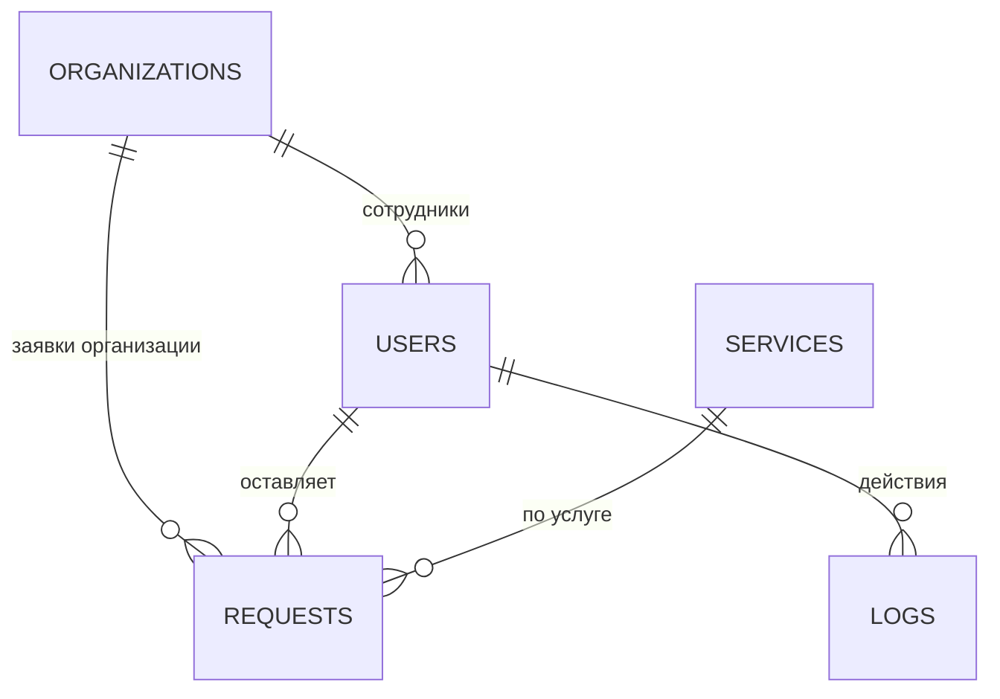

# Пояснительная записка
## Веб-сайт «kitinfo.ru» — обслуживание 1С, ИТ-аутсорсинг, аренда серверов, ремонт ККТ

---

## 1. Индивидуальное задание (заполнение бланка)

| Пункт | Значение |
|---|---|
| **Тип сайта** | Корпоративный сайт ИТ-компании с личным кабинетом клиента и админ-панелью (визитка + приём и обработка заявок) |
| **Разделы сайта** | Главная, Услуги, О компании, Контакты (форма заявки), Личный кабинет пользователя, Админ-панель (Дэшборд / Услуги / Пользователи / Заявки / Журнал действий) — итого 6 разделов |
| **Количество таблиц в БД** | 5: `organizations`, `users`, `services`, `requests`, `logs` |
| **Особые требования к правам доступа** | Гость — просмотр публичных страниц и отправка заявки без регистрации; Пользователь — личный кабинет, история своих заявок; Администратор — CRUD услуг, управление пользователями (роль/блокировка), обработка заявок (смена статуса), просмотр журнала логов. Доступ к `/admin/*` закрыт для гостя и пользователя на уровне сервера (`Auth::requireAdmin()`), а не только скрытием ссылок в интерфейсе |
| **Веб-сервер** | Apache 2.4 (mod_php или PHP-FPM + mod_proxy_fcgi) |
| **Язык серверной части** | PHP 8.x (без фреймворка — чистый PHP + PDO, для прозрачности учебного материала) |
| **СУБД** | MySQL 8.0 (совместим с MariaDB 10.5+) |
| **Дополнительные требования** | Адаптивный дизайн (mobile-first, брейкпоинты 880px/720px), серверная и клиентская валидация форм, защита от SQL-инъекций (PDO prepared statements, `ATTR_EMULATE_PREPARES=false`), защита от XSS (`htmlspecialchars` через хелпер `e()`), защита от CSRF (токен на сессию), хеширование паролей (bcrypt, `password_hash`), защита от подбора пароля (блокировка после 5 неудачных попыток), HTTPS на проде (заголовки в `.htaccess` + рекомендация HSTS) |

---

## 2. Цель и назначение разработки

Сайт решает три задачи:
1. **Витрина услуг** — потенциальный клиент (гость) видит перечень услуг и может оставить заявку без регистрации.
2. **Личный кабинет клиента** — зарегистрированный пользователь видит историю своих заявок и их статус.
3. **Панель администратора** — сотрудник компании ведёт каталог услуг, обрабатывает заявки, управляет пользователями и видит журнал действий в системе.

## 3. Архитектура системы

Архитектура — классическая трёхзвенная веб-схема, без фреймворка, на «чистом» PHP с явным разделением слоёв:

```
┌───────────────┐      HTTP/HTTPS       ┌─────────────────────────┐      SQL (PDO)      ┌──────────────┐
│   Браузер      │ ─────────────────────▶│   Apache + PHP 8         │ ────────────────────▶│   MySQL 8     │
│ (HTML/CSS/JS)  │ ◀───────────────────── │   /public/*.php           │ ◀──────────────────── │  база kitinfo │
└───────────────┘                        └─────────────────────────┘                      └──────────────┘
```

### 3.1 Клиентская часть
- **HTML** — генерируется PHP-шаблонами (`templates/header.php`, `templates/footer.php`), без отдельного SPA-фреймворка — это сознательное решение для учебного проекта: упрощает понимание потока «запрос → PHP → HTML».
- **CSS** (`public/assets/css/style.css`) — адаптивная вёрстка на Flexbox/CSS Grid, тёмная тема с акцентным цветом, брейкпоинты для мобильных устройств, видимый `:focus-visible` для доступности.
- **JS** (`public/assets/js/main.js`) — мобильное меню (burger), подтверждение опасных действий (`data-confirm`) перед отправкой форм удаления.

### 3.2 Серверная часть (PHP)
Каталог `src/` — слой приложения, не доступен напрямую через веб (документ-рут указывает на `public/`):

| Файл | Назначение |
|---|---|
| `config.php` | Константы конфигурации, настройки сессии, режим вывода ошибок |
| `Database.php` | Singleton-обёртка PDO, единая точка подключения к MySQL |
| `Auth.php` | Регистрация, вход, выход, проверка ролей (`requireUser`, `requireAdmin`), защита от подбора пароля |
| `Csrf.php` | Генерация/проверка CSRF-токена на форму |
| `Validator.php` | Серверная валидация входных данных |
| `Logger.php` | Запись событий в таблицу `logs` |
| `helpers.php` | `e()` (экранирование XSS), `redirect()`, flash-сообщения |
| `bootstrap.php` | Точка входа — подключает всё перечисленное и стартует сессию |

Каталог `public/` — точки входа (контроллеры) и статика:
- Публичные страницы: `index.php`, `services.php`, `about.php`, `contacts.php`, `request.php`
- Аутентификация: `register.php`, `login.php`, `logout.php`
- Личный кабинет: `dashboard.php`
- Админ-панель: `admin/index.php`, `admin/services.php` (+ `service_edit.php`, `service_delete.php`), `admin/users.php` (+ `user_edit.php`), `admin/requests.php` (+ `request_status.php`), `admin/logs.php`, общий guard `admin/_guard.php`

### 3.3 База данных
СУБД — MySQL 8.0, движок InnoDB (нужен для внешних ключей), кодировка `utf8mb4`.

**ER-схема (текстовое представление):**

```
organizations (1) ───┬──< users (N)            -- организация → её сотрудники-пользователи
                      └──< requests (N)         -- организация → её заявки

users (1) ──< requests (N)                      -- пользователь → его заявки (NULL для гостевых заявок)
users (1) ──< logs (N)                          -- пользователь → записи журнала (NULL для гостевых событий)

services (1) ──< requests (N)                   -- услуга → заявки на эту услугу
```

Mermaid-версия (для рендера в инструментах, поддерживающих mermaid):



Подробное описание таблиц и DDL — см. `database/schema.sql`.

### 3.4 Разграничение прав доступа

| Действие | Гость | Пользователь | Администратор |
|---|:---:|:---:|:---:|
| Просмотр публичных страниц | ✓ | ✓ | ✓ |
| Отправка заявки | ✓ | ✓ | ✓ |
| Просмотр своих заявок | ✗ | ✓ | ✓ |
| `/admin/*` (CRUD услуг, пользователи, журнал) | ✗ | ✗ | ✓ |

Проверка роли выполняется **на сервере** в каждой точке входа админки (`Auth::requireAdmin()` в `admin/_guard.php`), а не только скрытием пунктов меню — это исключает обход ограничений прямым переходом по URL.

## 4. Этапы разработки
1. Постановка ТЗ и индивидуального задания (раздел 1 этого документа).
2. Проектирование схемы БД (`database/schema.sql`) и тестовых данных (`database/seed.sql`).
3. Реализация слоя `src/` (БД, аутентификация, валидация, CSRF, логирование).
4. Реализация публичных страниц и формы заявки.
5. Реализация регистрации/входа/личного кабинета.
6. Реализация админ-панели (CRUD услуг, управление пользователями, заявками, журнал).
7. Оформление адаптивной вёрстки и базовой защиты (заголовки безопасности в `.htaccess`).
8. Тестирование (см. `docs/07_testing_report.md`) и подготовка документации.

## 5. Скриншоты
В среде разработки, где готовился этот пакет, отсутствует возможность развернуть Apache/MySQL и сделать реальные снимки экрана (см. ограничения в `docs/03_install_guide.md`, раздел «Примечание о тестировании»). После разворачивания проекта на сервере (см. инструкцию по установке) рекомендуется сделать и вставить сюда снимки экрана:
- главной страницы;
- каталога услуг;
- формы регистрации/входа;
- личного кабинета с заявками;
- дэшборда администратора;
- списка заявок и журнала логов в админ-панели.
